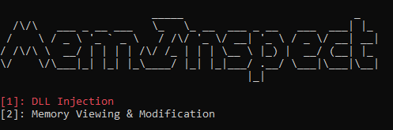

# MemInspector

MemInspector is a command-line tool that allows you to monitor and modify the memory of a target process. You can also inject a custom DLL into the target process, providing real-time monitoring of its memory modifications. Additionally, you can enter commands to read and write to the process's memory, giving you more control over a particular value in memory.

<u>Note</u>: MemInspector is currently in development. The program is not yet fully tested and may contain bugs or stability issues.

## Features

<b>1: Injects a custom DLL into a target process to monitor its memory</b>
 
<b>2: Monitoring of process memory and API calls</b>

<b>Reading and writing to process memory using custom commands</b>

## Usage

To use MemInspector, simply run the `meminspector.exe` file and use the number keys to navigate the menus.
